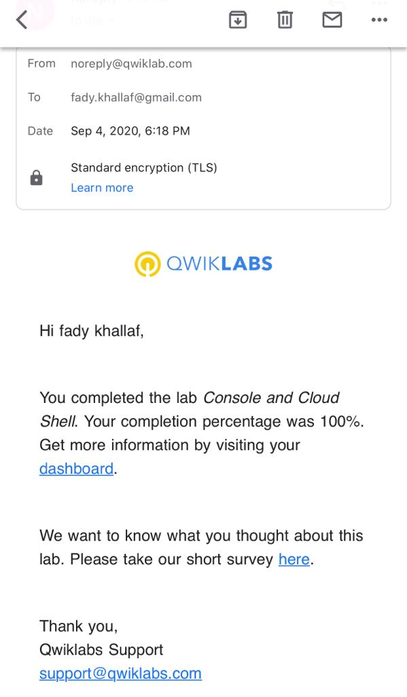
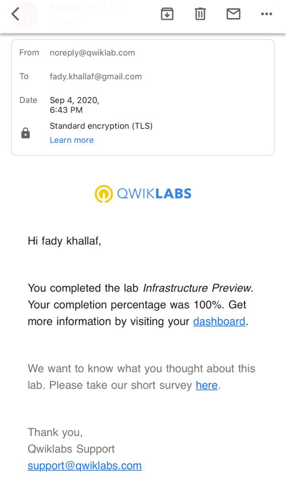
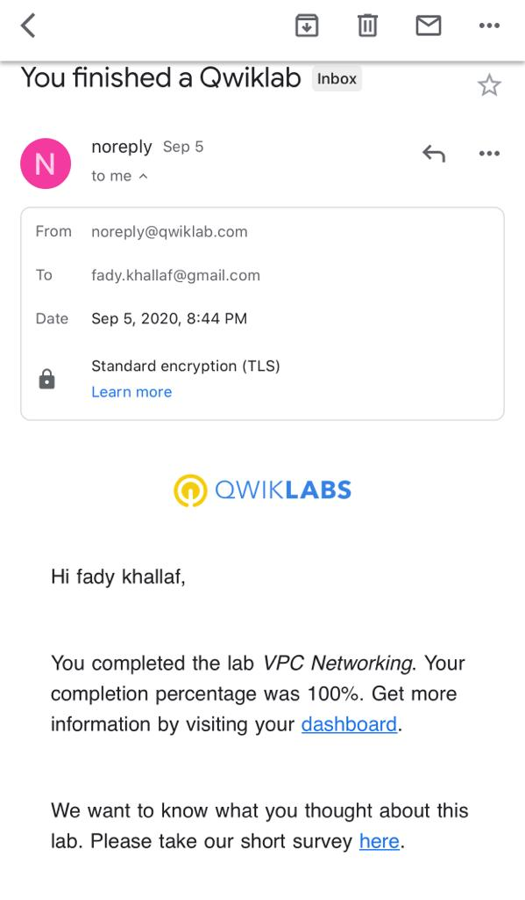
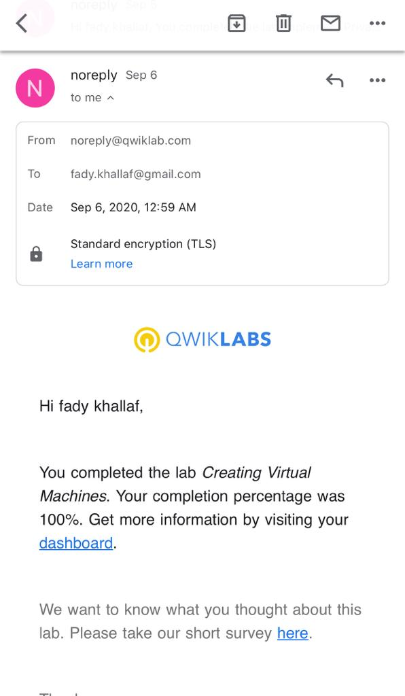
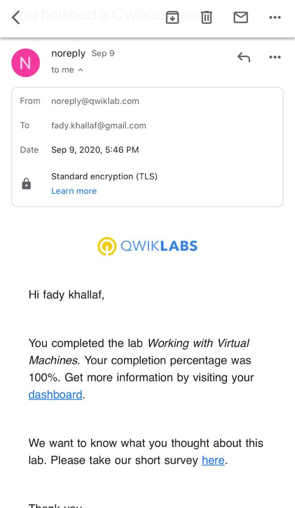
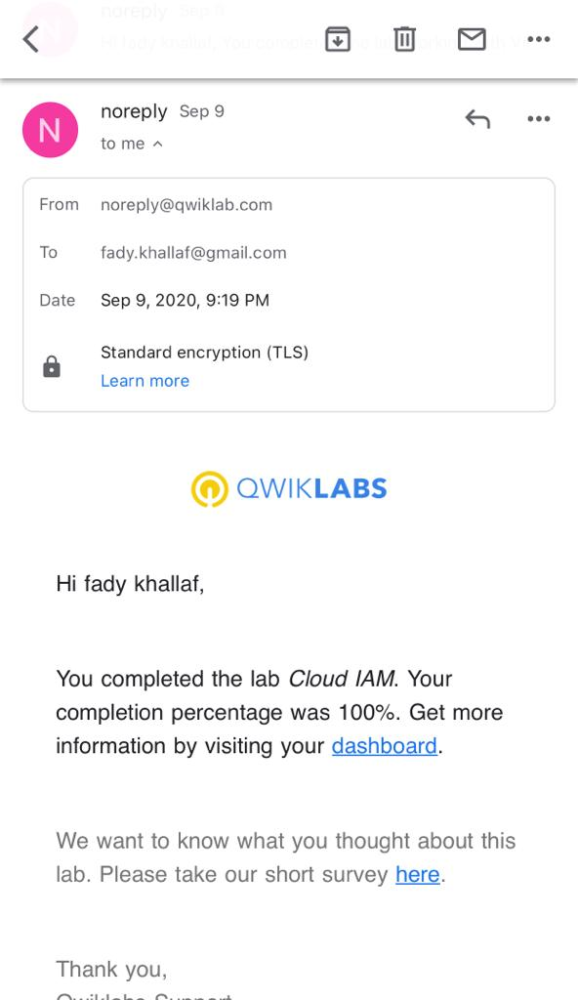
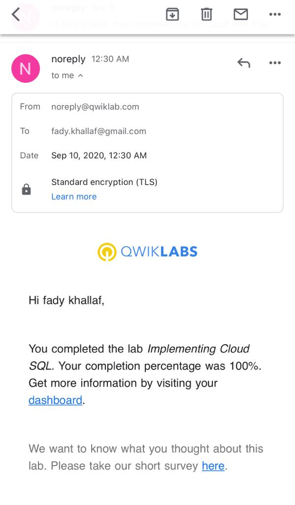
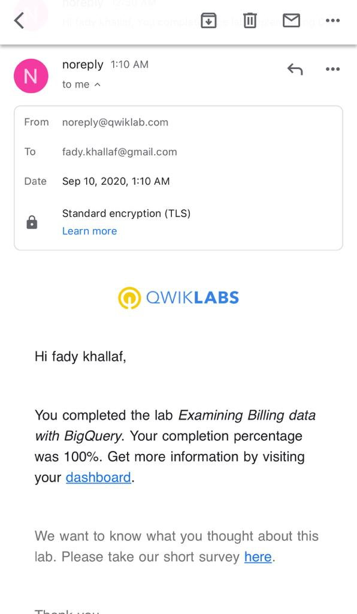
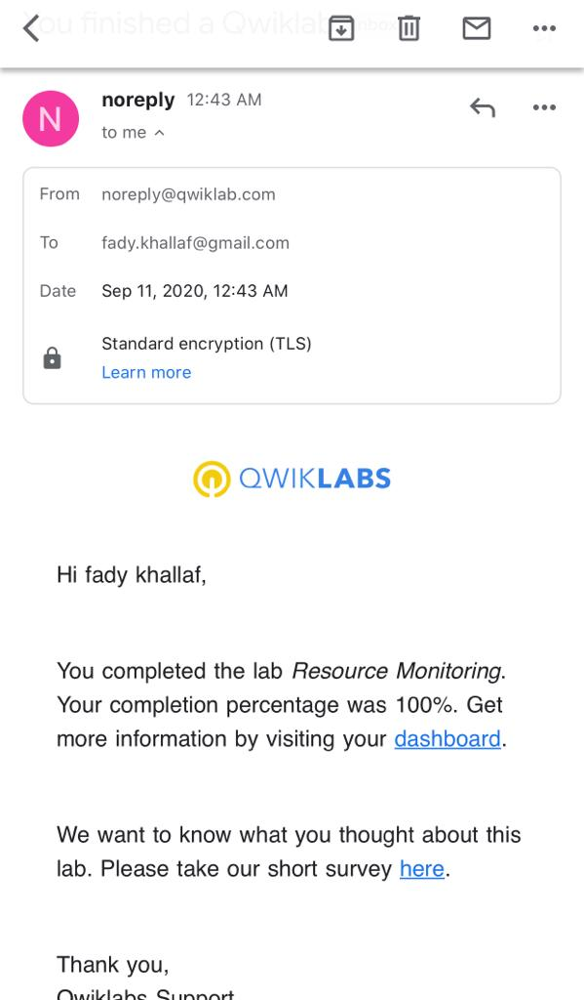
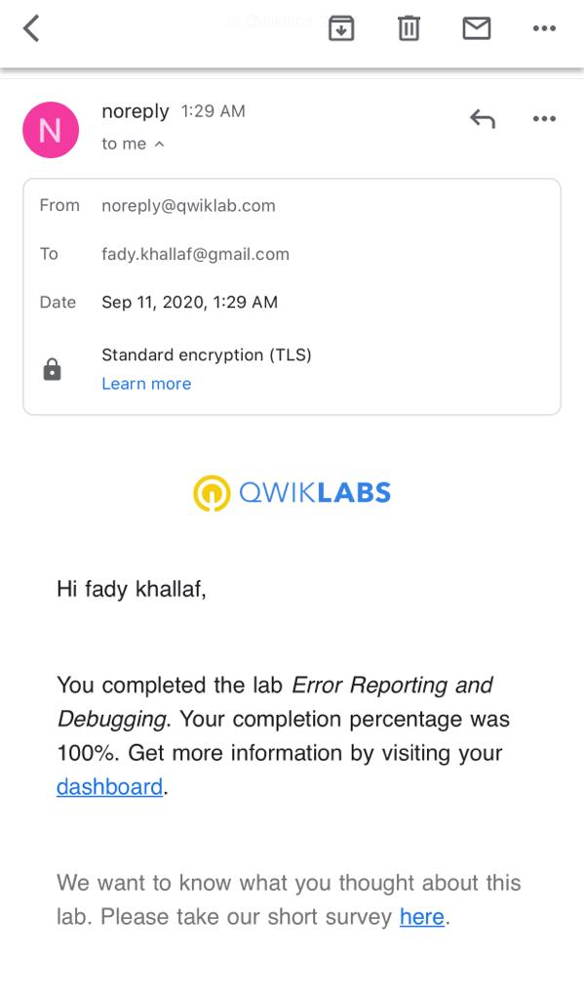

# GADS2020-Practice-Project

A Google Africa Developer Scholarship **ACE** Practice Project.
here is a bunch of the screenshots for the labs which I have done on qwiklabs.

## QwikLabs Completed

### Lab 1: Console and Cloud Shell

---

### Lab 2: Infrastructure Preview

---

### Lab3: VPC Neworking

---

### Lab4: Implementing Google Private Access and Cloud NAT

---

### Lab5: Creating Virtual Machines

---

### Lab6: Working with Virtual Machines

---

### Lab7: Cloud IAM

---

### Lab8: Implementing Cloud SQL

---

### Lab9: Examining Billing data with BigQuery

---

### Lab10: Resource Monitoring

---

### Lab11: Error Reporting and Debugging

